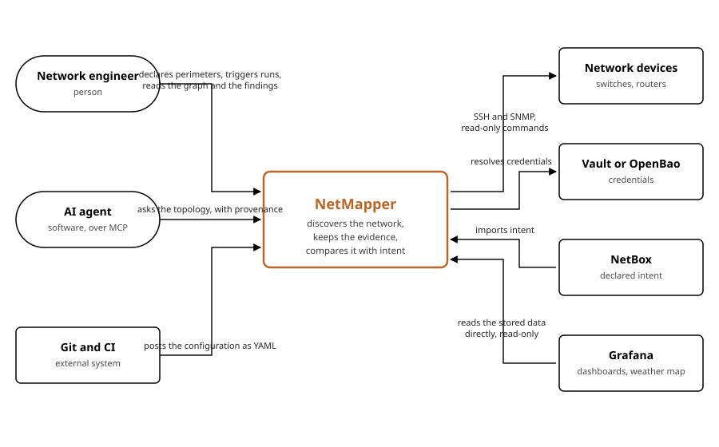

# C4 level 1: system context

| | |
|---|---|
| Status | Draft for review |
| Date | 2026-08-27 |
| Scope | NetMapper as one box, and everything around it |

## Who uses it

| | Kind | What they do with it |
|---|---|---|
| Network engineer | person | declares perimeters, credentials and seeds, triggers or schedules runs, reads the graph, the diffs and the findings |
| AI agent | software, over MCP | asks the topology a question and receives the answer together with its evidence and its age |

The agent is not an afterthought. It is the reason provenance and freshness travel with every answer: a human tolerates an unqualified fact and works around it, an agent acts on it.

## What it depends on

| System | Direction | What crosses |
|---|---|---|
| Network devices | NetMapper reaches out | SSH and SNMP, read-only commands, drawn only from loaded platform packs |
| Vault or OpenBao | NetMapper reaches out | resolves a credential reference into a value, for the time of a run |
| NetBox | NetMapper reaches out | imports declared intent, read only, and never writes back |
| Git and CI | reaches in | posts the configuration as a YAML document, so what is deployed is what was reviewed |
| Grafana | reaches in | reads the database directly for dashboards and a weather map, read only and outside the API contract |

Two of these deserve a word.

NetMapper never writes to NetBox. Pushing discovered devices into the documentation would destroy the difference between what is and what was declared, and that difference is the product.

Grafana reads PostgreSQL rather than the API, which is a deliberate exception rather than a second supported output. The read API (005) does not replace it: the exception stands, and it now has an API contract to be outside of. The built-in interface stays plain because the graph and the weather map are expected to live in Grafana, joined to metrics NetMapper does not collect.

## What crosses no boundary

Device credentials never leave the collector's memory. The configuration document carries a reference, the vault holds the value, and no interface returns it, to anyone, at any level of privilege.
