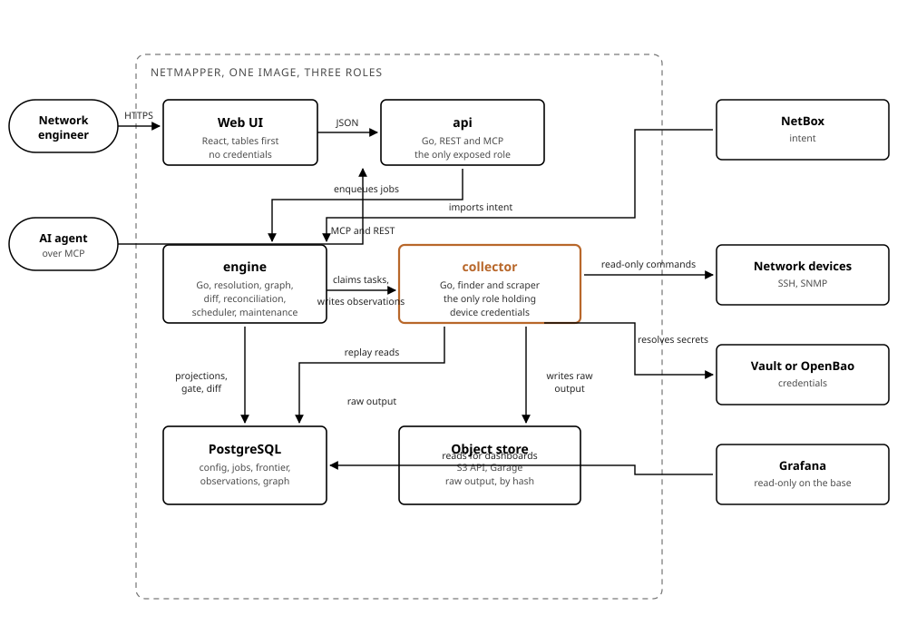

# C4 level 2: containers

| | |
|---|---|
| Status | Draft for review |
| Date | 2026-08-27 |
| Scope | What runs inside NetMapper, and what each part is allowed to do |

## The containers

| Container | Technology | Responsibility | Exposed | Holds credentials |
|---|---|---|---|---|
| `collector` | Go | crawls, fingerprints, probes candidates, runs recipes, writes observations and raw output | no | yes, and it is the only one |
| `engine` | Go | resolves identities, projects the graph, closes snapshots and applies the gate, computes diffs, reconciles with intent, schedules jobs, runs maintenance | no | no |
| `api` | Go | REST and MCP, configuration, jobs, reads of the graph and the findings | yes, and it is the only one | no |
| Web UI | React | device tables and one-hop neighbourhood views | through `api` | no |
| PostgreSQL | database | configuration, jobs, task frontier, observations, projected graph, findings | no | secret references only |
| Object store | S3 API, Garage | raw command output, addressed by content hash | no | no |

One binary, one image, three roles selected by subcommand. Three binaries would complicate the build without separating anything further.

## How they talk

| From | To | Through | Why |
|---|---|---|---|
| Web UI | `api` | HTTPS, JSON | the only path a browser takes |
| AI agent | `api` | MCP | topology questions with provenance |
| `api` | PostgreSQL | SQL | configuration, jobs, reads of the graph |
| `engine` | PostgreSQL | SQL | projections, gate, diffs, and enqueuing scheduled jobs |
| `collector` | PostgreSQL | SQL, `FOR UPDATE SKIP LOCKED` | claims tasks from the frontier, writes observations |
| `collector` | Object store | S3 | writes raw output under its hash |
| `engine` | Object store | S3 | reads raw output during a replay |
| `collector` | Network devices | SSH, SNMP | the only component that ever does |
| `collector` | Vault | HTTPS | resolves a credential reference at collection time |
| `engine` | NetBox | HTTPS | imports intent |
| Grafana | PostgreSQL | SQL, read only | dashboards, outside the API contract |

## Why it is cut this way

The frontier lives in PostgreSQL rather than in a collector's memory, which is what makes three things possible at once: a crash loses nothing, a device is never visited twice after a restart, and several collectors can share one frontier the day network reach requires it.

The `engine` never opens a session to a device, so the component doing the heavy computation has no reason to hold a secret and no path to the network. The `api` never does either, so the component anyone can reach cannot log into anything.

Splitting the finder from the scraper inside the collector is a separate question, and it is not about throughput. One Go process handles thousands of concurrent sessions.

The two are task types on one queue, not two programs. The `collector` is a pool of workers pulling from the frontier, and a task says whether it is a `find` or a `scrape`. Running the same image twice with `--consume=find` and `--consume=scrape` splits them across hosts the day a segment allows a finder where a full collector is not welcome, and neither side needs to know the other exists.

Neither name is a protocol either. The finder asks SNMP for `sysObjectID` and falls back to one SSH command when SNMP is silent; the scraper runs CLI recipes and reaches for SNMP on the bulk tables.
